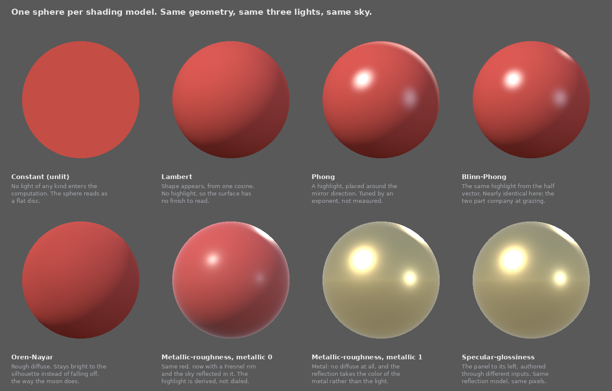

# Describing a surface: the empirical way and the physically based way

For an engineer who does not work in graphics. It compares the older way a 3D part carried its appearance, an empirical shading model with a single image, against the physically based way that glTF uses. It covers what each stores, what each asks the author to decide, how the numbers are encoded, and how to read a file of either kind.

It is deliberately general. Nothing here is specific to this project's parts, tools or conventions; those live in [model-spec.md](model-spec.md) and [VISUAL_ASSET_PIPELINE_REVIEW.md](VISUAL_ASSET_PIPELINE_REVIEW.md).

**Status: outline with subsections.** Section headings carry one line on what they do; notes in italic say what a subsection will establish and will be replaced.

## 1. Two independent choices: shading model and format

Two independent choices: which shading model, and which format. A shading model is a reflection model plus a parameterization.

Textbooks, specifications and engines do not agree on nomenclature. These names all refer to the same thing:

| Name | Used by |
|---|---|
| shading model | Marschner and Shirley ch. 4 and 10, Hoffman 2013, Burley 2012, Unreal, OpenPBR |
| material model | glTF specification, Filament, Burley 2012 |
| reflection model, BRDF model | Marschner and Shirley ch. 24, pbrt |
| lighting model, illumination model | Eck, OpenGL-era texts |

This document uses the term shading model for the pair of a reflection model, the equations describing how light reflects at a point on a surface, and a parameterization, the rules mapping user-defined values to variables in the reflection model equations. 


### 1.1 Shading model: the package a renderer evaluates at a point on a surface
*The unit every renderer and authoring tool works in: a reflection model, 1.1.1, plus a parameterization, 1.1.2.*

*Category: empirical or physically based, according to how the reflection model was derived. Empirical means adjusted until it looked right; physically based means derived from a physical picture of the surface, with energy conservation and reciprocity as design goals.*

*Microfacet, Cook and Torrance 1982, is the family of physically based models built from the picture of a surface as many tiny mirrors.*

#### 1.1.1 Reflection model: what is computed at a single point
*Reflection model and BRDF, bidirectional reflectance distribution function, are synonymous. Both name a function of two directions, where the light comes from and where the viewer is, returning how much of the light arriving along the first leaves along the second. Marschner and Shirley 18.1.6 defines it by describing the instrument that would measure it: a light in one direction, a detector in the other, one reading per pair of directions.*

Written out, with the material held fixed:

```
BRDF(light direction, view direction)

        radiance leaving toward the view direction
   =    ------------------------------------------         units: 1/steradian
        irradiance arriving from the light direction
```

*Inputs: two directions, four numbers in all, since each direction is two angles. Output: one value per wavelength, in units of inverse steradians. Parameters: the material's own values, 1.1.2, which are constants of the function rather than inputs to it, and which is why changing roughness gives a different function rather than a different answer from the same one.*

*Plot that value over every outgoing direction and the shape is called a lobe: narrow and spiked for a mirror, broad and nearly hemispherical for matte paint. The word is used throughout for the shape of a model's response.*

*Most models have more than one. Constant has none. Lambert and Oren-Nayar have a single diffuse lobe. Phong and Blinn-Phong have two, a diffuse lobe with a specular one on top, and Cook-Torrance under either parameterization also has two, though its diffuse lobe falls to nothing for a pure metal. The layered supersets of 2.2.4 add one more for every layer.*

*The value is not a bounded ratio. It is a density, light out per unit light in per unit solid angle, so a mirror's lobe spikes far above one while a white matte surface sits flat at one over pi. The bounded quantity is the lobe's integral over all outgoing directions, the share of arriving light that leaves at all, and that is what cannot exceed one. Marschner and Shirley 18.1.6 calls it the directional hemispherical reflectance; it is the energy conservation half of the test in 1.1.*

*The analogy with a probability density holds, and is worth carrying. Both are densities that mean nothing until integrated over a domain. The difference is the total: a probability density integrates to exactly one, while a BRDF's integral is at most one, the shortfall being the light the surface absorbed. Renderers use the analogy literally, sampling the BRDF as though it were a distribution, which Marschner and Shirley 24.2 lists as a requirement for a model to be usable.*

*It is per wavelength. A renderer evaluates it three times, once each for red, green and blue, which is why base color is a color while roughness is a single number. How three numbers come to stand for a whole spectrum, and how those three are encoded once they reach a file, is 8.4.*

*Lobes add. A model with a diffuse and a specular lobe is their sum, and it is the sum that has to stay within one, which is why the models of 2.2.2 scale the diffuse lobe down by whatever the specular lobe already took.*

*Adding is the principle; in practice the terms are weighted, and the weighting is where models differ from one another. glTF layers specular over diffuse with a Fresnel weight, one minus F times the diffuse plus F times the specular, then blends that whole dielectric result against a metal result according to metallic. Marschner and Shirley 24.4 gives an older scheme built to keep the pair reciprocal. Filament spends a section putting back the energy a single-scattering model loses at high roughness. None of these is settled: glTF Appendix B says of its own weighting that it "breaks a fundamental property that a physically based BRDF must fulfill, energy conservation".*

*Three acronyms one letter apart, and the letter is the direction the light leaves. A BRDF, R for reflectance, covers light that leaves on the side it arrived from. A BTDF, T for transmittance, covers light that goes through and leaves on the far side. A BSDF, S for scattering, is the two together; Filament states it as a BSDF "composed of two other functions: the BRDF and the BTDF". Anything opaque needs only the BRDF, which is why this document says reflection model throughout. The exception is 2.2.4, where adding transmission makes the model a BSDF.*

#### 1.1.2 Parameterization: how an author supplies values to the reflection model
*The author-facing parameters and the rule mapping them to the reflection model's variables. Empirical reflection models take their coefficients directly; physically based ones derive them from friendlier inputs.*

*The two are not one to one, which is why they are named separately. One reflection model can have several parameterizations: Cook-Torrance takes both metallic-roughness and specular-glossiness, section 3. The reverse does not happen, since a parameterization is written to produce one reflection model's variables. Every other row of 1.1.3 has a single parameterization, so there the two names pick out the same thing.*

#### 1.1.3 The shading models in use

| Shading model | Reflection model | Parameterization | Category |
|---|---|---|---|
| Constant, also called unlit | none; the color is returned unchanged | one color | neither: no light enters the computation |
| Lambert | cosine law | diffuse reflectance | physically based, see 2.2.1 |
| Phong, Blinn-Phong | cosine-power lobe over Lambert | ambient, diffuse, specular, emission, shininess | empirical |
| Oren-Nayar | microfacet diffuse | diffuse reflectance, roughness | physically based |
| Cook-Torrance with metallic-roughness | Cook-Torrance microfacet | base color, metallic, roughness | physically based |
| Cook-Torrance with specular-glossiness | the same | diffuse color, specular color, glossiness | physically based |
| The layered supersets, 2.2.4 | the same, plus one lobe per layer | the three above plus a group per layer | physically based |

*Constant is the minimal case and the one to read first: no lights, no directions, no surface normal, just the color as authored. Everything below it in the table is a way of deciding how much of the light arriving at a point leaves it toward the eye.*



*Figure. One sphere per row of the table, same geometry, same three lights, same sky, so the only variable is the shading model. Regenerated by `docs/_tools/shading_models_figure.py`. The last two panels are the same reflection model reached through different parameterizations, and they agree to floating-point noise.*

*The two Cook-Torrance rows are named here by their pairing. Most sources say just "metallic-roughness", letting the parameterization stand for the whole shading model, which is why 3.2 says which of the two is meant.*


### 1.2 Format: which file carries the result

The other independent choice. A format can carry one shading model, several, or none.

| Format | Shading models it can carry |
|---|---|
| glTF 2.0 | Cook-Torrance with metallic-roughness, in core; constant and the layered supersets, by extension |
| COLLADA | constant, Lambert, Phong, Blinn-Phong |
| OBJ with MTL | constant, Lambert, Phong; Cook-Torrance with metallic-roughness only by unofficial extension |
| FBX | Lambert, Phong; anything physically based only in vendor blocks |
| STL | none, geometry only |
| USD | Cook-Torrance with metallic-roughness, and the same reflection model under a specular parameterization |
| MaterialX | any of them, since it describes shading networks rather than naming a model |

*The names in the right column are the shading model names of 1.1.3. Most formats and most documentation shorten "Cook-Torrance with metallic-roughness" to "metallic-roughness", naming the parameterization and letting it stand for the pair.*

*A format usually names a shading model and says which parameters it stores, but not the equation those parameters feed. COLLADA has a `<phong>` element holding five values and no statement of what to compute from them. Because Phong exists in several variants, two readers that both conform can render the same file differently.* 

*That is the gap glTF 2.0 closes. It is a container and, in Appendix B, a normative definition of exactly one shading model, Cook-Torrance with metallic-roughness, the fifth row of 1.1.3. That matters because the core of a conformant file can express only that one shading model; anything else, constant or a layered superset, arrives as a named extension that a reader is free to ignore. Relying on the name alone would not have been enough, since the literature holds several versions under this name and others like it. This is why glTF appears in section 3 as a source for equations and in section 4 as a format.*

*It does not go so far as to make two implementations equivalent. The specification allows that implementations of the BRDF "MAY vary based on device performance and resource constraints", and calls conformant any implementation that "adheres to the rules for mixing BRDFs". Its own sample renderer is described as using non-physical simplifications that break energy conservation and reciprocity.*

*So what is pinned is everything an author controls and two readers must agree on: the parameters, their defaults, their encoding, which channel of which image carries what, and the structure that combines the lobes. What is left open is the numerical choice inside each lobe. Two conformant renderers will not match pixel for pixel, but they will not disagree about what the material is, and that second kind of disagreement is the one that used to happen.*

*Section 4 expands this table and separates what a format can express from what its readers implement.*

## 2. The shading models in common use

Each model in 1.1.3: character, cost, where it fits, what it cannot represent, with lobe illustrations. The models are described independently of any file format; where a specification is named it is as a published source for the math.

### 2.1 Empirical shading models
#### 2.1.1 Phong
*Marschner and Shirley 10.2; Eck 4.1.4 for the OpenGL form.*
#### 2.1.2 Blinn-Phong
*The half-vector variant and the typical exponent values, Marschner and Shirley 4.5.2.*

### 2.2 Physically based shading models
#### 2.2.1 Lambert
*Passes the test and predates the movement; no specular term, so not "PBR" in everyday usage. Its role is the diffuse term inside the microfacet models. Marschner and Shirley 18.1.6.*
#### 2.2.2 Cook-Torrance, and the microfacet idea
*Roughness as the width of the microfacet distribution, hence of the lobe.*
##### The three factors inside a microfacet reflection model
*A microfacet reflection model is not one equation but a template. Its specular part is always written the same way, three functions over a fixed denominator, and each has a standard name and a standard letter: D, the normal distribution function; G, the geometry function, also called masking-shadowing; and F, the Fresnel term. Cook and Torrance 1982 introduced the form, and Walter et al. 2007 is its modern reference.*

*D decides how the microfacets are oriented, and so how wide the lobe is. G decides what fraction of them the light and the eye can both see, which matters most at grazing angles. F decides how much of the light striking a facet reflects rather than entering the surface, which rises as the view flattens.*

*Three is the count for the specular part. A complete shading model pairs it with a diffuse term, which for glTF is Lambert, 2.2.1.*

*Each slot has several published candidates and an implementation picks one per slot, so the combination rather than any single choice is what a given renderer means by the microfacet model. The usual three are Trowbridge-Reitz for D, published in 1975 and renamed GGX by Walter et al. in 2007, which is the name in use everywhere now; Smith for G; and Schlick's approximation for F. Hoffman 2013 puts it that most papers proposing a new microfacet model are best read as proposing a new function for one slot.*

#### 2.2.3 Oren-Nayar, and other physically based diffuse models
*Lambert's replacement for surfaces rough at the microscopic scale. It keeps a surface bright out to its silhouette instead of falling away, which is why the moon reads as a disc rather than a sphere. Physically based and microfacet, but diffuse only.*

#### 2.2.4 The layered supersets: Disney principled, Standard Surface, OpenPBR
*They are not extra parameters on one reflection model, which is why they sit here rather than in section 3. Each adds a lobe: a clearcoat is a second specular BRDF evaluated on top of the first, sheen swaps in a different D, transmission adds a transmitted term and so turns the BRDF into a BSDF. Both halves grow together, the reflection model and the parameterization.*

*Layer is meant literally and the stack is ordered, not a free set. OpenPBR calls the pieces slabs and fixes their order, coat over base and fuzz over coat. Each is optional and off by default, so a material using none of them is exactly Cook-Torrance with metallic-roughness. They cannot be reordered or swapped for one another.*

*That core is the only thing they extend. Nobody layers a clearcoat onto Phong or Lambert, so the supersets sit on one row of 1.1.3 and no other.*

### 2.3 Where empirical and physically based overlap
*The two cases where the category of 1.1 and its plausibility test disagree. Blinn-Phong can be normalized so that it conserves energy: an empirical model that passes. And physically based models as shipped often fail it, because real-time renderers approximate for speed. So the category records how a model was derived, and plausibility is a separate question asked of the result.*

### 2.4 Side by side: cost, and what each cannot represent
*The figure of 1.1.3 read as a table: what each model computes, roughly what it costs per pixel, and the one thing each cannot do. Lambert has no highlight, Phong has no Fresnel, Cook-Torrance has no cheap path.*

## 3. Parameterizations

The layer where two tools most often disagree while both claiming PBR.

### 3.1 Why the author's parameters are not the reflection model's variables
*Two worked examples. The author's roughness is not the equation's variable: glTF 2.0 Appendix B says "the reflection roughness is given by the squared roughness of the material", and Filament devotes a section, Roughness remapping and clamping, to why. And specular color at normal incidence is never asked for; it is derived from base color and metallic.*

*The design rule behind both is Burley 2012, page 12: "Intuitive rather than physical parameters should be used", first of five principles, the others being as few parameters as possible, zero to one over their plausible range, pushable beyond it where sensible, and robust in every combination.*

### 3.2 The metallic-roughness parameterization
*The name does double duty and this subsection is about the parameterization half: three inputs, base color, metallic and roughness, and the rule that turns them into a blend of a dielectric and a metal BRDF. glTF 2.0 Appendix B writes the blend out.*

### 3.3 The specular-glossiness parameterization, and why it was retired
*The specular-color workflow that predates the metallic idea. Same reflection model, so the two can render identically; it costs one more image and lets an author state combinations no real material has.*

*Deprecated for glTF, yes: Khronos moved the extension to the archived section of the registry, so a file written today should not use it. It is not gone from the world, since older files carry it and some authoring tools still offer the workflow, which is why it has a subsection here rather than a footnote.*

### 3.4 Where metallic-roughness came from: the core of Disney principled
*Burley 2012 with its layers switched off. glTF Appendix B names it as the source of the metallic blend.*

## 4. Which formats carry which

Section 1.2 said what each format can express. This section is about the distance between that and what its readers do.

### 4.1 What each format can express
*The table of 1.2 expanded: one row per format, naming the element or block that actually carries the material, and the version of the format it arrived in.*

### 4.2 Expressible and implemented are different questions
*A format's capability is an upper bound, never a promise. The layered supersets reach glTF as extensions, so a conformant reader may ignore them and fall back to the core. OBJ's physically based additions are unofficial and most readers skip them.  Reading a file tells you what was written, not what will be shown.*

## 5. The shared substrate: geometry and texture coordinates

What both ways agree on. A surface is triangles, and each corner carries a position, a normal, at least one pair of texture coordinates, and optionally a tangent and a color.

### 5.1 Vertices, triangles and indices
*A triangle is three indices into an array of vertices, so one vertex serves many triangles and is stored once. That indirection is why vertex count and triangle count are not proportional.*

### 5.2 Vertex attributes: position, normal, texture coordinate
*Includes hard and soft edges, which look like a rendering choice and are geometry. A hard edge exists because two faces do not share vertices, each carrying its own normal. The author controls it, it is stored in the file, and it is why vertex counts exceed corner counts. This is also where the technique word "shading" is disposed of: flat shading and smooth shading, in Eck 4.1.3 and Marschner and Shirley 10.1.3, name whether a vertex carries its face's normal or an averaged one, and have nothing to do with which shading model is evaluated.*

### 5.3 UV coordinates: an address on an image for every vertex
*Two numbers per vertex naming a spot in an image, carried like any other attribute and independent of where the vertex sits in space. glTF calls the first set TEXCOORD_0 and allows more than one, which is how a model can read its base color and its occlusion from differently arranged images.*

### 5.4 Unwrapping, and why a curved surface must be cut before it will lie flat
*No closed curved surface flattens without tearing, so the author chooses where to cut. The cuts are seams, they duplicate vertices, and the pieces between them are the shells that get arranged on the image.*

### 5.5 Texel density: image resolution measured on the surface rather than in the image
*Pixels per meter of surface, not pixels per side of the image. It is the number that decides whether a 512 image is generous or starved for a given part, and it is why two parts in one scene can look like they came from different libraries.*

## 6. What each way asks the author to supply

The two practices end to end, once the vocabulary and the models are in place.

### 6.1 Under an empirical model: ambient, diffuse, specular, emission, shininess
*Five; Eck 4.1.1, COLLADA `profile_COMMON`.*

### 6.2 What those numbers are, and what they are not
*Marschner and Shirley 24.5: a Phong specular coefficient "typically must be tuned for viewpoint in static images and tuned for a particular camera sequence for animations," against a Fresnel reflectance confined to roughly 0.03 to 0.06 for real dielectrics.*

### 6.3 What has to be painted into the single image
*Everything the model cannot compute: shadow in a crevice, a bright edge along a rim, a suggestion of reflection. Painting them in is not laziness, it is the only place to put them, and it is what fixes the material to one lighting setup.*

### 6.4 Under metallic-roughness: six properties instead of one image
*Base color, metallic, roughness, normal, occlusion and emissive. The list is closed and every entry has a default, so a material that says nothing is not neutral, it is white, fully metallic and fully rough.*

### 6.5 Supplying a value two ways: a constant, an image, or both
*Each property takes a factor written in the material, a texture, or both, in which case the factor multiplies what the texture supplies. A property given neither keeps its default, and a texture given without a factor is multiplied by one.*

### 6.6 Base color
*The surface's own color with no lighting in it at all. A texture here is sRGB and a factor is linear, which is the trap: the same number in the two places does not mean the same thing.*

### 6.7 Metallic
*A claim about what the object is made of, not a style dial. Nearly binary in reality, so the map is closer to a mask than a gradient, and a wrong value is not slightly wrong.*

### 6.8 Roughness
*How wide the specular lobe is, hence how sharp a reflection the surface returns. Squared before it reaches the equation, 3.1, so the slider is perceptual rather than physical.*

### 6.9 Normal
*Fine detail faked by perturbing the normal instead of adding triangles. Stored in tangent space, which is what lets one image be reused across surfaces and survive the object bending.*

### 6.10 Occlusion
*How much ambient light reaches into a crevice. The one entry in the list that describes the surroundings rather than the material, and the one a renderer could in principle compute for itself.*

### 6.11 Emissive
*Light the surface gives off on its own. Unaffected by every light in the scene, which makes it the only property that still shows when nothing is lit.*

## 7. The two ways side by side

The comparison itself, once both have been described.

### 7.1 Level by level
*Summary table placeholder. Rows: shading model, Blinn-Phong or Lambert against Cook-Torrance with metallic-roughness; category, empirical against physically based; parameters set directly against derived through a parameterization; author-supplied values; the element carrying it in a file, `<phong>` inside `profile_COMMON` against `pbrMetallicRoughness`; formats that can carry it.*

### 7.2 What each can express, and what it cannot
*Empirical cannot express a metal whose reflection takes the metal's own color, nor a surface that behaves correctly as the view flattens. Physically based cannot express a look that was never physical, which is occasionally the whole point of reaching for an empirical model.*

### 7.3 What each requires the author to decide
*Five coefficients tuned by eye against six properties largely looked up or measured. The second asks for more values and fewer judgment calls, which is a different kind of work rather than more of it.*

### 7.4 How well each survives being opened in a different tool
*An empirical material is a set of numbers whose meaning is not written down anywhere the reader can consult. A glTF material is, 1.2. This is the practical argument, and it is the one that decides deliveries.*

### 7.5 How each behaves under lighting the author did not choose
*The whole difference in a single test: move the light. A physically based material is still right; an empirical one is wrong in a way no setting recovers, because the lighting it assumed is baked into its numbers and its image.*

### 7.6 What each costs in data
*One image against as many as five, partly offset by packing three properties into the channels of a single image, 8.5. Textures dominate the byte count either way.*

## 8. How the data is stored and encoded

The layer underneath both: how numbers and images become bytes, and the encoding decisions that are invisible until they are wrong.

### 8.1 Numbers in a buffer: offset, type, count
*A buffer is an undifferentiated run of bytes. An accessor says where to start reading, what type to read, and how many, and a bufferView sits between them describing the slice. Nothing about meaning lives in the bytes themselves.*

### 8.2 Vertices and indices, and what a triangle costs in bytes
*Position, normal and one texture coordinate set is thirty-two bytes a vertex before indices. Worth doing once, because it settles most arguments about triangle budgets by showing where the bytes actually are.*

### 8.3 Images: PNG and JPEG, and what the container does not record about them
*The only two encodings the specification requires a reader to support. JPEG is lossy in a way that is invisible on base color and clearly visible on a normal map, where the block artifacts become shading artifacts.*

### 8.4 Color images and data images: sRGB against linear
*Three numbers stand in for a spectrum: red, green and blue are point samples, chosen to match human vision rather than to describe the light, which is why two materials can match on screen and differ under a spectrometer. Base color and emissive are sRGB and must be decoded before any arithmetic; every other map holds data and is already linear. Which rule applies is decided by how the material refers to the image, never by anything inside the image file, and glTF ignores an embedded color profile outright.*

### 8.5 Packing several quantities into one image
*Occlusion, roughness and metallic in the red, green and blue channels of one image. Three unrelated quantities in one file, none of them a color, which is why the packed image looks like nothing when opened.*

### 8.6 Defaults, and what a file leaves unsaid
*Every field has one and silence is never neutral. A primitive with no material at all gets white, fully metallic, fully rough, which is why an unassigned region shows up as a pale metal patch rather than disappearing.*

## 9. Reading a glTF file end to end

One complete part in the text form, where the description, the geometry and the images sit in separate files that reference each other.

### 9.1 The file set: the JSON, the binary buffer, the images beside them
*Three kinds of file for one part: a `.gltf` holding the structure as JSON, a `.bin` holding the numbers, and the images. Listing them first makes the rest of the section a matter of following names between them.*

### 9.2 From scene to triangle: the chain of references, read top to bottom
*scene, node, mesh, primitive, accessor, bufferView, buffer. Each step is an index into the next array, and walking it once end to end is the point of the section. Also where to show what a glTF file holds that has nothing to do with materials.*

### 9.3 The material, and how it names its images
*Where glTF's `material` object is met: the data object holding one shading model's parameters, as distinct from the shading model itself, section 1. It reaches an image only through a texture, which pairs that image with a sampler.*

### 9.4 The two containers: a `.gltf` with its files beside it, against a single `.glb`
*The same content packaged two ways. A `.glb` concatenates the JSON and the binary into one file and embeds the images, which is what a delivery normally is; the text form is what you open when you want to read it.*

## 10. Glossary

Every term used above, defined in one place for lookup rather than for reading in order.

### 10.1 The terminology of section 1
*Shading model with its four synonym families, reflection model, BRDF, BTDF, BSDF, lobe, parameterization, physically plausible, physically based, empirical, microfacet, format, and "shading" as the technique word of 5.2.*

### 10.2 The texture words
*Image, sampler, texture, material, property, channel, factor, sRGB, linear, tangent space, texel. The pair most often run together is property and channel, so both are defined against each other.*

### 10.3 The geometry words
*Vertex, corner, triangle, index, primitive, mesh, node, attribute, normal, tangent, UV, seam, shell, texel density, hard and soft edge.*

### 10.4 The storage words
*Buffer, bufferView, accessor, component type, stride, `.gltf` against `.glb`, embedded against referenced, and the two image encodings.*

## 11. Further reading

In the order worth reading them, with what each is good for and where each stops.

**1. Marschner and Shirley, *Fundamentals of Computer Graphics*, 4th ed., section 4.5.** Six pages, and the fastest route into the whole empirical picture: Lambert, Blinn-Phong, the ambient term, and the vectors they are built from. Section 10.2 repeats it with more care, 18.1.6 defines the BRDF by measurement, and chapter 24 treats reflection models on their own. Its vocabulary is the one this document follows. What it lacks: published 2016 and it predates the industry settling on metallic-roughness, so it never names GGX or metallic-roughness, and the models chapter 24 recommends are not the ones that shipped.

**2. The [glTF 2.0 specification](https://registry.khronos.org/glTF/specs/2.0/glTF-2.0.html), section 3.9.** Short, normative, and the actual delivery target. Read it for what a material is allowed to contain and what every default is. What it lacks: it is a specification, not an explanation, and it gives no intuition for any value it defines.

**3. [Physically Based Rendering in Filament](https://google.github.io/filament/Filament.html), the material system sections.** The clearest free account of the physically based half, and the one that separates the reflection model from the parameterization the way this document does, under the headings Standard model and Parameterization. Its figures are systematic sweeps rather than one-off renders. What to watch: it is one renderer's documentation, so several approximations are Filament's own choices rather than universal practice.

**4. Eck, *[Introduction to Computer Graphics](https://math.hws.edu/graphicsbook/)*, chapter 4.** Free, plain-language, and the best treatment of the five empirical coefficients, with a live demo that lets you move each one. What it lacks: it stops at the door of the physically based half and says so, so read it for the older way only.

**5. Burley, *Physically Based Shading at Disney*, SIGGRAPH 2012, section 5.** Three pages for the five design principles and the parameter list that metallic-roughness was cut down from. The primary source for why the author's parameters are not the equation's variables. What is dated: the specific functions have moved on, and Disney's own later work extends this to a BSDF.

**6. glTF 2.0 Appendix B.** The exact equations, once the four above have been read. It is the normative definition of Cook-Torrance with metallic-roughness, and it is candid about its own approximations, saying outright that its recommended way of combining diffuse and specular breaks energy conservation.

**7. Hoffman, *Background: Physics and Math of Shading*, SIGGRAPH 2013.** The derivation, from the behavior of light at a surface to the microfacet BRDF and its three factors. Read it when the three slots of 2.2.2 stop feeling arbitrary and start feeling unexplained. It asks more of the reader mathematically. Later editions of the same course update the practice around it, but this physics section remains the clearest.

**8. Pharr, Jakob and Humphreys, *[Physically Based Rendering](https://pbr-book.org/)*, 4th ed., the reflection models chapter.** Free online, and the deepest treatment here. Useful for a different and more careful taxonomy: it sorts models by where they came from, measured data, phenomenological, simulation, wave optics, geometric optics, rather than by the empirical and physically based split used here. What to expect: it is an offline renderer's textbook and very long.

**9. The [OpenPBR Surface specification](https://academysoftwarefoundation.github.io/OpenPBR/).** Where the layered supersets of 2.2.4 are heading, written as a stack of slabs. Newest of these and the one most likely to matter next; tool support is still thin.

**Two tools rather than texts.** [Disney's BRDF Explorer](https://github.com/wdas/brdf) loads reflection models as code, graphs them, applies them to a model, and puts them beside measured materials, which is the fastest way to see how two models differ. The [glTF Sample Viewer](https://github.khronos.org/glTF-Sample-Viewer-Release/) shows a file as a conformant renderer sees it and validates it at the same time.
