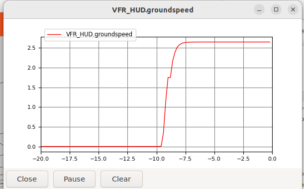
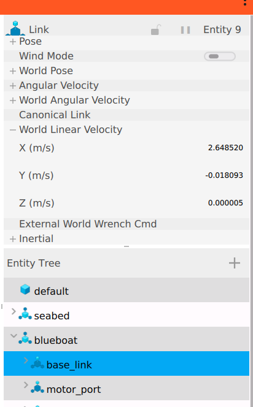
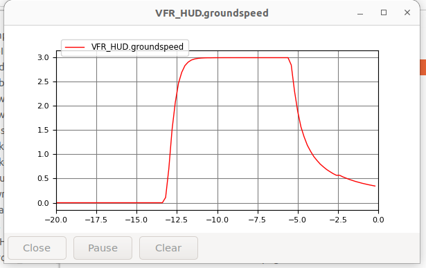
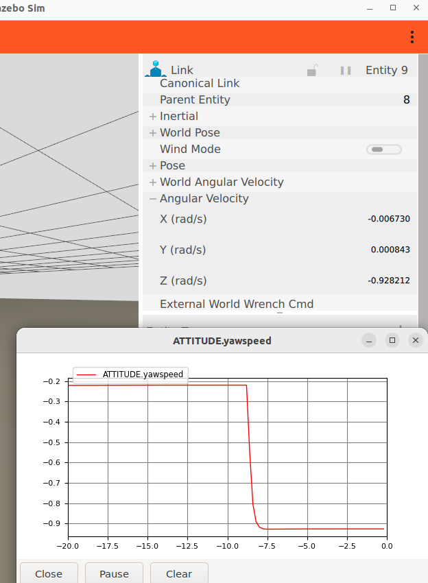
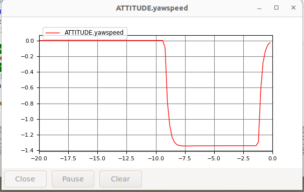

# BlueBoat Parameters

This documents the sources and methods used to define the default BlueBoat vehicle dynamic and autopilot parameters.  


```{note}
OUTLINE. The tables below are headings and empty rows; each is filled in as
phase 4 of the [SITL spec](../../specs/SITL_SPEC.md) produces it. Nothing
here is measured yet.
```

## Approach

Our approach in defining the BlueBoat parameters is as follows:

1. Use the easily measurable parameters, e.g., mass
1. Use what is provided as autopilot stabilization layer parameters 
1. Derive what we can from first principles and approximation, e.g., inertia tensor
1. Select via testing and qualitative comparison, the hydrodynamic parameters that can not be easily measured or estimated.  These are the free parameters to tune the response to match (qualitatively) the known closed-loop performance. 


## Set via reference 

See {download}`parameter_refs.ods <../../reference/parameter_refs.ods>` for the calculations.

| | Source | Value | Destination|
|---|---|---|---|
| Mass | [BlueBoat spec sheets](https://bluerobotics.com/store/boat/blueboat/blueboat/) Boat chassis + 2 batteries | see [../parameter_refs.ods]  | blueboat_chassis.urdf.xacro |
| Inertia tensor | Estimated based on uniform box and L, W, H dimensions BR specs. Consistent with original values. | see [../parameter_refs.ods] |  blueboat_chassis.urdf.xacro |
| Thrust limits | Deduced from [thruster performance](https://bluerobotics.com/store/thrusters/t100-t200-thrusters/m200-motor/?attribute_cable-variant=BlueBoat+-+0.71+meter+cable+length+%2B+M14+WLP) at 16 V and max forward total thrust value from [blueboat specs](https://bluerobotics.com/store/boat/blueboat/blueboat/) | see [../parameter_refs.ods] | bluerobotics_parts/urdf/m200_weedless_prop_ccw.urdf.xacro and bluerobotics_parts/urdf/m200_weedless_prop_cw.urdf.xacro (known issue that they are repeated)
| Deadband | Approximated from the graph for the [m200](https://bluerobotics.com/store/thrusters/t100-t200-thrusters/m200-motor/?attribute_cable-variant=BlueBoat+-+0.71+meter+cable+length+%2B+M14+WLP) and engineering judgement. Small deadband.  Can be tuned out with PWM settings per vessel. | | bluerobotics_parts/urdf/m200_weedless_prop_ccw.urdf.xacro


### Drag estimates - open loop

Derive estimates of the linear and quadratic drag based on published maximum velocity specs.

#### Surge

##### Estimate
From blueboat specs, max speed is 3 m/s and the max static thrust is 8.2 kgf.   The Fossen drag implementation has both a linear and quadratic terms.  We neglect the linear term and estimate the quadratic coefficient - see [../parameter_refs.ods] 

##### Test - Open-loop surge response

Run a test to command full forward thrust and measure the steady state speed.  Compare the the 3 m/s target.

Run the scenario for the open-loop (`MANUAL`) test - [Verify the SITL connection (Boat)](../../how-to/verify-sitl-boat.md)

Verify the speed of the USV two ways (do both, to make sure the simulated model state agrees with the state the autopilot senses):


1. In Gazebo use UI to view the World Linear Velocity of the blueboat/base_link.  (USV travels in x, so no need to resolve to body-frame.)
2. In MAVProxy...

```
module load graph
graph VFR_HUD.groundspeed
```

Then command full speed
```
rc 3 1900
```

The results do not meet expectations, we expected 3.0 m/s, but observe a steady-state speed 2.65 m/s.   




##### Select in test

The referenced values give us a starting point.  We test and modify manually to get the desired but test the end-to-end behavior.  We reduce the quadratic drag so that there is a margin on necessary control authority to achieve closed loop speed of 3 m/s.



#### Yaw

##### Estimate

Because we don't have a spec on the open-loop yaw rate, we need to either estimate the open-loop yaw rate or deduce values from the known control parameters.  It is a coarse estimate, but we can use the value for the FF param from the published autopilot params - `ATC_STR_RAT_FF` = 0.8.   A simple estimate is to consider the linear case where the FF term is the inverse of the plant dc gain.  if you trace that through the autopilot system, that would be consistent with a linear drag value of -14.5 and we expect a turn rate max of 1.25 rad/s. 

##### Test - open-loop yaw response

We run a similar test as described for surge to measure the max (full thrust) open-loop yaw response.  


Again, check the steady state yaw rate in both the sim and the autopilot to make sure they are consistent. 

```
module load graph
graph ATTITUDE.yawspeed

```

Then command full yaw rate
```
rc 1 1900
```





##### Select in test

 As expected the yaw-rate is less than the target, so we iteratively reduce the linear yaw drag term to get an open-loop response with sufficient control authority to achieve the desired closed-loop response.



## The autopilot parameter file

 This section is about the *autopilot's* configuration.

The file is `blueboat_gazebo/params/blueboat_sitl.params`. It is derived from Blue Robotics' dump off a vehicle, `params/ardupilot/ArduRover/4.7/Navigator/BlueBoat120.params` in [Blueos-Parameter-Repository](https://github.com/bluerobotics/Blueos-Parameter-Repository), whose header reads *Vehicle: Surface Boat / Platform: navigator / Version: 4.7.0-BETA*. That dump is 951 lines, most of it one unit's accelerometer calibration, radio setup and logging. Ours carries only the subset that describes the vehicle — frame, outputs, motor limits, control gains, speeds — plus the deltas simulation requires. Every value is the shipped one unless a `DELTA` comment beside it says otherwise.

It is loaded last. `-f rover-skid` makes `sim_vehicle.py` load ArduPilot's own `rover.parm` and `rover-skid.parm` first, which supply the SITL side (fake accelerometer calibration so pre-arm passes, `SIM_PIN_MASK`, the mode slots) but also set `SERVO1/3_MIN/MAX` to 1000/2000 and `SERVO1_FUNCTION 73` / `SERVO3_FUNCTION 74` — the reverse of the shipped boat. Our file sets each of those again, and the last file wins. 

### Provenance: three descriptions, and they disagree

There is no single authoritative description of a configured BlueBoat. There are three:

| Source | What it is | Authoritative for |
|---|---|---|
| `BlueBoat120.params` | a dump off real hardware, including that unit's own calibration | the vehicle as built: frame, output assignment, motor limits, gains, speeds |
| Blue Robotics' SITL set | the parameters they use for their own simulation | nothing by default — useful as a second opinion where the dump is ambiguous |
| the `SITL_Models` block | the BlueBoat contributed to ArduPilot's model repository | nothing by default — it is a third party's simulation, not the manufacturer's vehicle |

They differ on things that change behavior: which channel carries which throttle, whether a thruster is reversed, the servo range, the neutral trim, the cruise speed. So "we use Blue Robotics' parameters" is not by itself a well-defined claim, which is why the third column exists — it records which source wins for which kind of parameter, so a disagreement becomes a decision rather than an accident.

The rule we follow: the hardware dump is authoritative for the vehicle, because it is the only one of the three describing a boat that exists. The other two are consulted, not copied. Where a value is taken from one of them instead, or changed for simulation, it carries a `DELTA` comment.

### Deltas, and the cross-checks

TBD — the line-by-line table: every parameter in our file, which source it came from, whether the three agree, and the reason for each `DELTA`.

TBD — the cross-checks, which are the places an autopilot parameter is allowed to say something about our model rather than the reverse:

- `MOT_THST_ASYM` against the thruster's forward/reverse ratio. Shipped is 1.6; our endpoints imply 2.0. Keeping 1.6 is what produces the steering clamp that makes full stick at zero throttle equal `ACRO_TURN_RATE`, so the disagreement is recorded as a finding about the vehicle's calibration rather than reconciled by moving a measured number.
- `ACRO_TURN_RATE` is absent from our file, so SITL uses the firmware default of 180 deg/s instead of the shipped 45. It needs adding before any turn-rate result is judged.
- `MOT_SLEWRATE` either represented, or shown to be dominated by the thruster's own dynamics.
- `SERVO_RATE` against the simulation rate.

## Modes

TBD — per mode: what the RC input commands, what the vehicle is observed to do, and which feedback the loop needs to close. Filled in from what the implementation establishes rather than from ArduPilot's documentation, which is thin for boats.

| Mode | Stick commands | Observed | Feedback required |
|---|---|---|---|
| `MANUAL` | | | |
| `ACRO` | | | |

## Open questions

TBD — anything that could not be resolved from published data: the question, why it matters, and what was assumed in the meantime.
