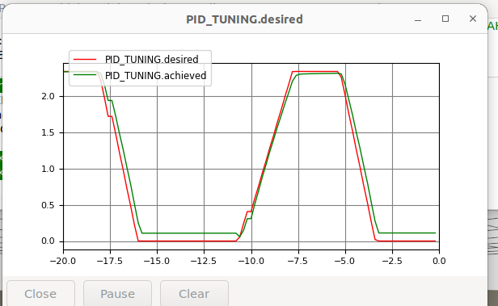
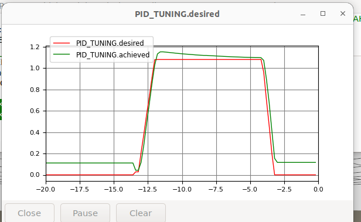
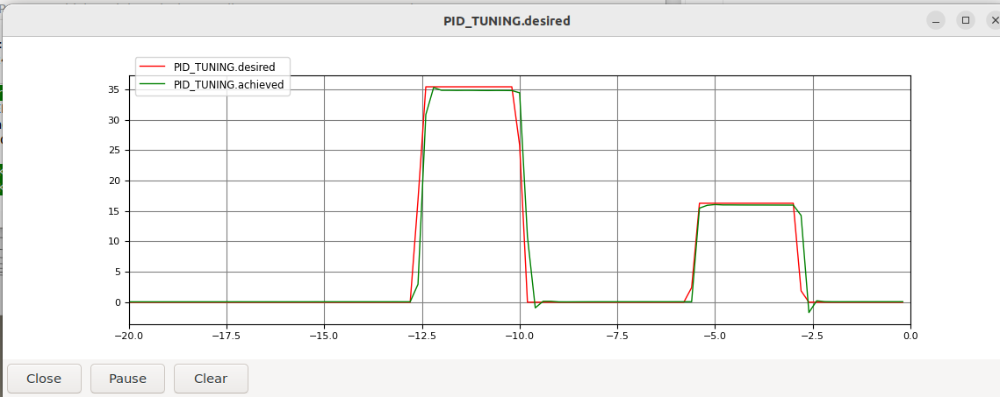

# Tuning of closed-loop response for BlueBoat

This walkthrough is to confirm that ArduRover's inner control loops (stabilization layer) drive the simulated BlueBoat the way the hardware behaves, under Blue Robotics' published gains. 

This closed-loop mode is Ardu's `ACRO` mode where R/C channel 3 is a speed command (PWM command, scaled in Ardu to a setpoint in m/s) and channel 1 is a yaw-rate command (PWM, scaled to yaw-rate by Ardu.)

## Prerequisites

* Setup and run the drydock + source development environment: [installation_drydock.md](../../getting-started/installation_drydock.md)
* [ArduPilot SITL setup](../../getting-started/ardupilot_setup.md); (the rest of this page assumes the Iris smoke test passed.)
* [Verify the SITL connection (Boat)](verify-sitl-boat.md) passes.

## Walkthrough

All commands are issued within the drydock dev container. Two shells, as in the verification walkthrough.

First, the simulation:

```bash
source ~/maritime_ws/install/setup.bash
source ~/maritime_ws/thirdparty/setup-ardupilot.sh
gz sim -v4 -r $(ros2 pkg prefix --share blueboat_gazebo)/worlds/blueboat_sitl.sdf
```

Then the autopilot:

```bash
source ~/maritime_ws/install/setup.bash
source ~/maritime_ws/thirdparty/setup-ardupilot.sh
AP=$HOME/maritime_ws/thirdparty/ardupilot/Tools/autotest
sim_vehicle.py -v Rover -f rover-skid --model JSON --console -w \
  --add-param-file=$AP/default_params/rover.parm \
  --add-param-file=$(ros2 pkg prefix --share blueboat_gazebo)/params/blueboat_sitl.params
```

### Test closed-loop response


These are qualitative tests that require engineering judgement.  It is important to state that fine tuning the interplay between the physics and the autopilot is not an objective of the simulation.  Getting the physics to sufficient fidelity to be able to develop transportable (sim2real) autopilot gains, is not feasible within the project scope, so we aim to reproduce the closed-loop behavior by tuning the system's closed-loop behavior, end-to-end, so that it reproduces the behavior of the closed-loop hardware.

#### Surge control

After you have the sim and autopilot (MAVProxy) running.


In MAVProxy, graph the autopilot internals
```
param set GCS_PID_MASK 2
module load graph
graph PID_TUNING.desired PID_TUNING.achieved
```
then arm and activate the stabilization layer control in `ACRO` mode.
```
arm throttle
mode acro
```

Send full forward speed command
```
rc 3 1900
```

Scaling from PWM to speed setpoint is set by `SPEED_MAX` in `blueboat_gazebo/params/blueboat_sitl.params`. It is only consulted when positive: left at its default of 0, ArduRover estimates the maximum as `CRUISE_SPEED / CRUISE_THROTTLE` instead (`Rover/mode.cpp:366-378`).


Results in



Sending half speed command 
```
rc 3 1700
```

Results:



#### Yaw-rate control

Setup to graph the autopilot internals for the yaw loop.
```
param set GCS_PID_MASK 1
module load graph
graph PID_TUNING.desired PID_TUNING.achieved
arm throttle
mode acro
```

Send full yaw-rate command
```
rc 1 1900
```
The `ACRO_TURN_RATE` parameter controls the mapping from R/C PWM to yaw-rate setpoint in deg/s.

Results:



Note: when first developed (see open-loop tuning in [./parameters.md]) the closed-loop yaw response held a constant bias - the achieved rate was above the setpoint.  This suggests that the FF term was not a match with the open-loop plant DC gain. 

With `ATC_STR_RAT_I` at 0 there is no integrator to adapt to the mismatch between FF and DC Gain. Writing `G` for the plant's DC gain in rad/s per unit steering output:

```
achieved / demanded = G(FF + P) / (1 + G·P)
bias                = (1 - G·FF) / (1 + G·P)
```

The bias is zero exactly when `G = 1 / FF`. 

 Steering output `u` reaches the water as a differential, with the reverse-going motor scaled by `MOT_THST_ASYM` (`AP_MotorsUGV.cpp`, "Apply asymmetry correction"), so the moment per unit output is

```
k = 0.301 m × (40.22 N + 1.6 × 20.1 N) = 21.8 N·m
```

and with linear damping the plant gain is `G = k / nR`. Setting `G = 1/FF` gives `nR = k · FF = 21.8 × 0.8 = 17.4`, which is where the `-18` in the model comes from - selected in test and corroborated by the derivation above. 

## Summary

This walkthrough demonstrates and verifies the tuning of the various boat and autopilot parameters to achieve the desired closed-loop performance in `ACRO` mode that mimics the closed-loop behavior of the hardware.   Because there are many more model parameters than test cases, we have many "colinear regressors" and an infinite number of parameter sets equally "correct" in terms of closed-loop behavior.  Our approach, discussed more in [Parameters](parameters.md), is to leave fixed what we know (a few physical parameters, thruster characteristics and autopilot settings) to modify the unknowns (hydrodynamic parameters) to design the closed-loop response. 