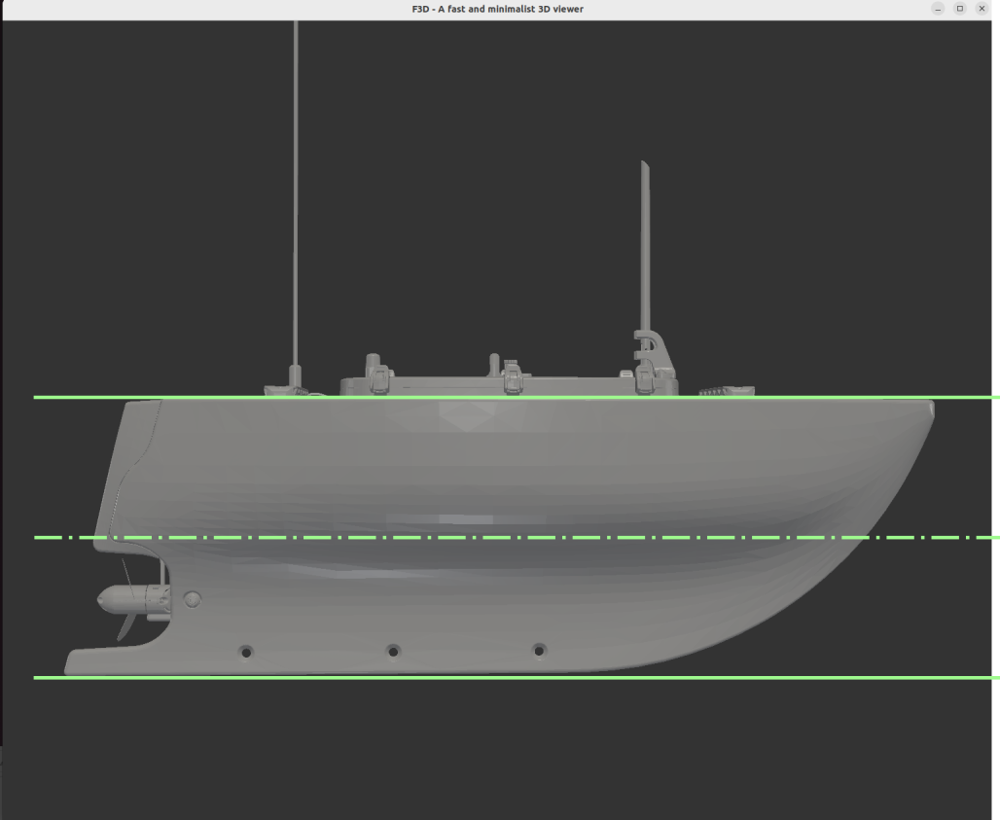
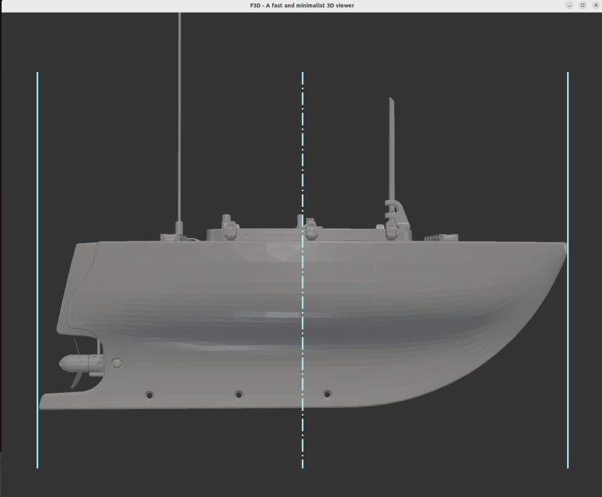
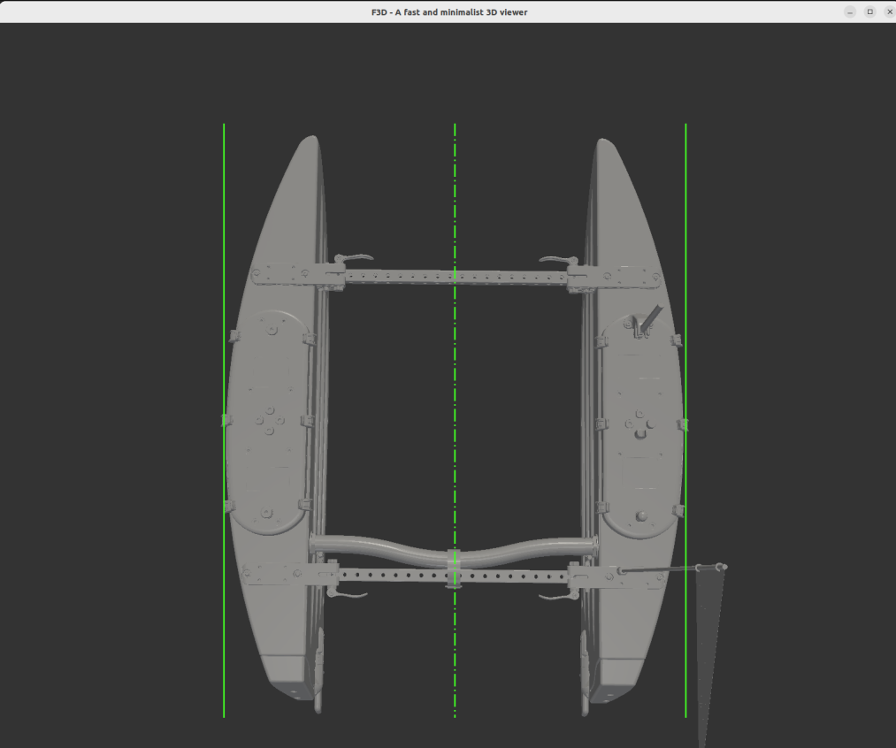

#  Commissioning materials for visual assets

This document has details, beyond the commission YAML file, to describe the visual 3D asset as described gltf-robotics.

## blueboat_chassis

### datum location

The location of the datum is defined relative to the geometry. The origin coordinate system of the USV is defined by the geometric extents of the hull as the intersection of three planes.

The XY plane is defined as equidistant from the XY plan tangent to the lowest extent of the hull (keel) and the XY plane tangent to the top of the plastic hull deck.

The YZ plane is defined as equidistant from the fore (bow) and aft (stern) extent of the hull .

The XZ plane is defined as equidistnat from the left (port) and right (stbd) extent of the two hulls when assebled as the chassis

The datum orign location is defined as the intersection of these three planes and is, loosely speaking, in the geometric center of the chassis, but, unlike the center of mass/gravity, this definition of the location does not change with modifying the details or materials of the asset. 

